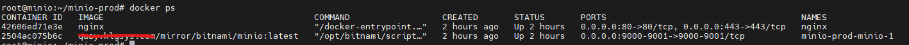
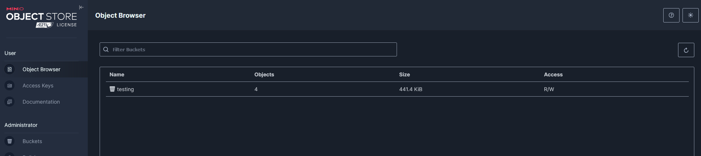

# Deploy Docker Compose Minio

```
docker-compose up -d
```
## access to consule the minio


====
# Download MC Client
```
wget https://dl.min.io/client/mc/release/linux-amd64/mc
chmod +x mc
sudo mv mc /usr/local/bin/
```
```
mc alias set myminio http://localhost:9000 access_key password_key
```